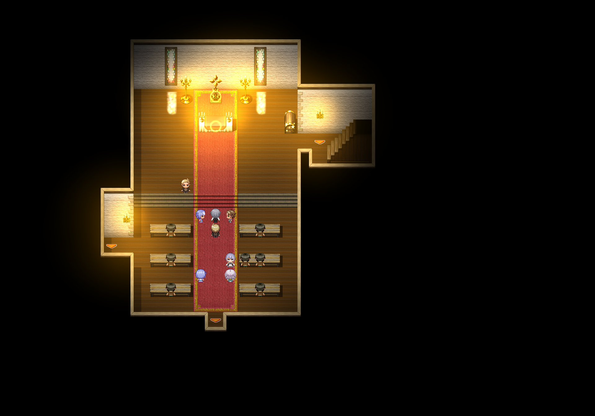
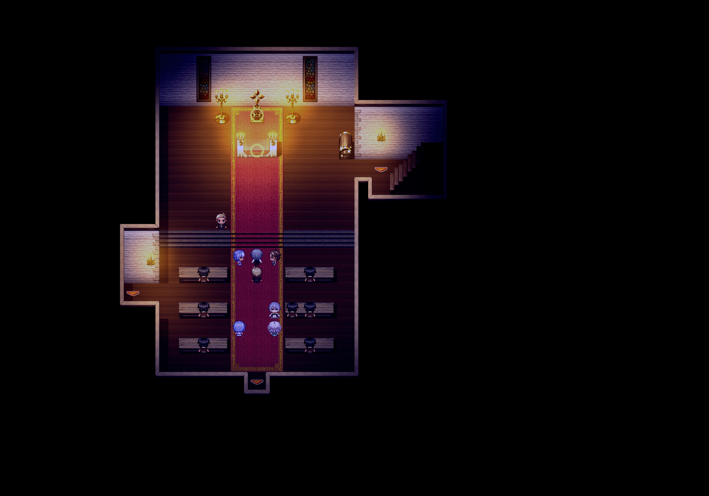

<div align="center">

# 🗺️ RPGmaper

从 RPG Maker MZ/MV 游戏文件离线提取 tileset、渲染地图、分析传送点的工具。

[](https://nodejs.org)
[](https://sharp.pixelplumbing.com)
[](https://www.electronjs.org)
[](LICENSE)

支持 **离线运行**：直接读取游戏文件（含加密解密），无需启动游戏即可导出地图。加密游戏（如 `mrd.min.bin`）也能正常处理。

</div>

---

## 📚 文档导航

| 文档 | 说明 |
|------|------|
| [快速开始](##-快速开始) | 两步上手：tileset 导出 → 地图渲染 |
| [桌面应用](##-桌面应用-electron) | Electron 桌面管理器与地图查看器 |
| [插件系统](##-插件系统) | HOOKS 机制、现有插件、开发指南 |
| [技术细节](##-技术细节) | Tile 系统、加密、渲染算法 |

---

## 📸 效果展示

エニシアと契約紋 ～馬蹄通りの小聖女～ Map22（教会礼拜堂）各时段渲染效果：

朝 (0) | 昼 (1) | 夕方 (2) | 夜 (3)
:---:|:---:|:---:|:---:
 |  |  | 

插件系统实现窗户/辉光昼夜切换、蜡烛分页、PLM 视差图层叠加。

---

## ✨ 核心功能

### 🎨 离线渲染管线

- **无头渲染** — 直接读取游戏 `data/Map*.json` + `img/tilesets/`，用 Sharp 逐像素合成，不依赖游戏运行时
- **加密解密** — 自动识别 RPG MV 加密文件（`png_` 头 `RPGMV\0…`），解密后处理
- **Tile 完整支持** — A1（流水/动画） / A2（地板） / A3-A4（墙壁/屋顶） / A5 / B-E / 阴影层，autotile 48 种形状表
- **大片地图** — 支持分 strip 渲染（`MAX_H=3800px`），Sharp composite 合成
- **视差地图** — 自动解密 `img/parallaxes/*.png_`，缩放填满地图尺寸后叠加 tile
- **传送点提取** — 扫描 Transfer Player 指令（code=201），递归解析公共事件调用链（code=117）

### 🖥️ 地图查看器

- **快速导航** — 下拉切换地图，滚轮缩放，拖拽平移
- **传送点系统** — 彩色高亮（绿=地图传送、蓝=公共事件、黄=可返回），点击跳转并显示事件详情
- **昼夜切换** — 下拉切换昼/夕方/夜，图像即时切换（不重载），色调同步
- **视差图层（PLM）** — 从事件 note 提取的图层，支持加算/阴影/乗算混合模式，逐像素合成
- **格子选择** — 点选格子查看坐标/tileId/事件，可复制到剪贴板
- **内容适配** — 自动裁剪空白边距，一键居中

### 🧩 插件系统

- **5 个钩子点** — `mapStart` / `beforeSprite` / `eventSprite` / `postRender` / `mapEnd`
- **零开销** — 无插件时 HOOKS 为空，管线性能无损耗
- **动态管线** — 插件可注册 CLI 脚本并声明 `after` 依赖，自动插入全流程
- **查看器插件** — 通过 UI 声明系统注册控件（下拉框、按钮、复选框）
- **无侵入** — 操心の魔導具（无插件）全流程不受任何影响

---

## 🚀 快速开始

### 方式一：CLI 命令行

```bash
# 1. 安装依赖
npm install

# 2. 导出 tileset（必须先执行）
node scripts/extract-tilesets.js <游戏目录>

# 3. 渲染地图
node scripts/render-maps.js <游戏目录>        # 全部地图
node scripts/render-maps.js <游戏目录> 1 5 10  # 指定地图

# 4. 提取传送点
node scripts/extract-transfers.js <游戏目录>

# 5. 全流程测试（tileset 导出 → 渲染 → 抽样检查）
node scripts/test-pipeline.js <游戏目录>
node scripts/test-pipeline.js <游戏目录> --verbose
```

**指定时段渲染**（配合插件系统）：

```bash
# 渲染夜间版本（需要 NightRender 插件）
TIME_VAR_31=3 node scripts/render-maps.js <游戏目录>
```

### 方式二：Electron 桌面应用

```bash
npm start
```

或双击 `rpgmaper.bat`。

<table>
<tr>
<td>📁 <b>项目管理</b></td>
<td>添加/删除游戏项目，自动扫描 tileset/地图/传送点输出状态</td>
</tr>
<tr>
<td>▶️ <b>全流程</b></td>
<td>一键运行 tileset 导出 → 地图渲染 → 传送点提取，动态显示进度</td>
</tr>
<tr>
<td>🗺️ <b>地图查看器</b></td>
<td>内置查看器，支持导航、传送点跳转、昼夜切换、PLM 图层开关</td>
</tr>
<tr>
<td>🧩 <b>插件管理</b></td>
<td>启用/禁用渲染插件，导入/导出插件文件</td>
</tr>
</table>

### 方式三：HTTP API 服务

```bash
# 启动地图关系 API（默认端口 3456）
node scripts/api-server.js
node scripts/api-server.js 8080
```

---

## 🧩 插件系统

### 现有插件

| 插件 | 钩子 | 功能 |
|------|------|------|
| **TileTime** | `mapStart` | 按 Variable 31（時間帯）替换 tile，窗户/辉光昼夜切换 |
| **TemplateEvent** | `beforeSprite` | 解析 `<TE上書き>` 标签，支持注释模板，蜡烛昼夜分页 |
| **ParallaxLayer** | `postRender` | 从事件 note 的 `<PLM:file>` 提取视差图层，输出到 `MapXXXX_plm/` |
| **MapTone** | — | 查看器中按地图 `<MAPTYPE>` 应用色调（昼/夕方/夜） |
| **NightRender** | — | 注册 CLI 脚本，渲染夜间版地图（`_night.png`） |
| **CGShift** | — | CG 场景偏移校正 |

### 创建渲染插件

```javascript
// scripts/plugins/MyPlugin.js
module.exports = {
  name: 'MyPlugin',
  description: '你的插件描述',
  hook: 'mapStart',  // mapStart | beforeSprite | eventSprite | postRender | mapEnd
  tags: ['tag1'],

  process: function(ctx) {
    // ctx.map       当前地图数据
    // ctx.gameDir   游戏目录
    // ctx.outDir    输出目录
    // ctx.mapId     地图 ID
    // global.TIME_VARIABLE_31  时段（0=朝 1=昼 2=夕 3=夜）
    // global.PLUGIN_ENC_KEY    加密密钥字节数组
  }
};
```

### 创建查看器插件

查看器插件放在 `electron/renderer/viewer-plugins/`，通过 `registerViewerPlugin()` 注册 UI 控件：

```javascript
(function() {
  registerViewerPlugin({
    name: 'MyViewerPlugin',
    hook: 'timeChange',
    ui: [
      {
        type: 'select',           // select | button | checkbox
        target: 'toolbar',
        label: '选项',
        options: [
          { value: 'a', label: 'A' },
          { value: 'b', label: 'B' },
        ],
        onChange: function(val) {
          // 用户选择时触发
        },
      },
    ],
  });
})();
```

---

## 📂 输出目录结构

```
maps/projects/<项目名>/
├── tilesets/                    # 导出的 tileset PNG
├── maps/                        # 渲染的地图
│   ├── Map0001.png              # 白天版本
│   ├── Map0001_night.png        # 夜间版本（可选）
│   ├── tilemaps_data.js         # tilemap 数据（查看器用）
│   └── Map0001_plm/             # 视差图层（可选）
├── parallax/                    # 视差背景图
├── transfers_data.js            # 传送点数据
└── test-report.json             # 测试报告
```

---

## ⚙️ 技术细节

| 项目 | 说明 |
|------|------|
| **Tile 尺寸** | 48×48px，autotile 子块 24×24px |
| **地图数据** | 4 层 tile (z=0,1,2,3) + 1 层阴影 (z=4)，扁平数组 `(z × h + y) × w + x` |
| **Autotile** | 48 种形状表（地板/墙壁/瀑布），每格拆 4 子块合成 |
| **阴影层** | 半透黑 overlay，alpha 0.35，`dst = dst × (1 - 0.35 × dst.alpha)` |
| **RPG MV 加密** | 16 字节头 `RPGMV\0\0\0\0\0\x03\x01\0\0\0\0\0` + body 前 16 字节与 key XOR |
| **时段变量**（插件 TileTime） | Variable 31：0=朝 1=昼 2=夕 3=夜 |
| **色调系统**（插件 MapTone） | 按 `<MAPTYPE>` 和时段叠加色调偏移，查看器端生效 |
| **视差图层**（插件 ParallaxLayer） | 从事件 note 解析 `<PLM:file>`，输出图层到 `MapXXXX_plm/` |
| **加密密钥** | `System.json` 中 `encryptionKey` 字段，32 位 hex 字符串 |

---

## 📝 许可证

本项目基于 MIT 许可证开源。详见 [LICENSE](LICENSE)。
